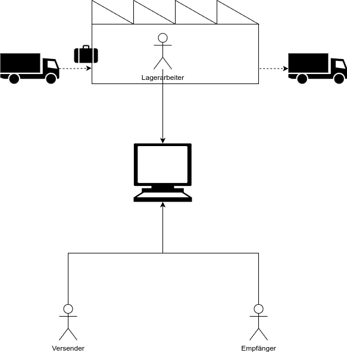
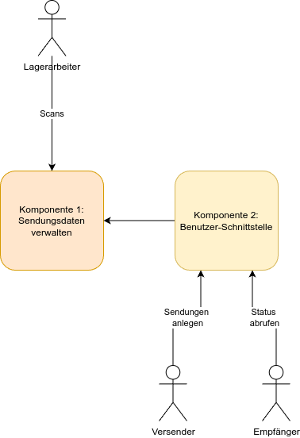

# Aufgabe

## Softwaresystem für ein Spediteur-Umschlaglager

Für ein Logistik-Unternehmen sollen wir ein System entwickeln, das die Prozesse beim Transport von Sendungen 
unterstützt. Versender können neue Sendungen erfassen. Wenn die Sendung im Umschlaglager ankommt scannen die 
Lagerarbeiter den Barcode der Sendung. Damit wird einerseits der Status der Sendung im System geändert. 
Andererseits erhält der Mitarbeiter im Lager die Information, in welchen LKW die Sendung verladen werden soll 
(zur Vereinfachung können hier die drei ersten Stellen der PLZ verwendet werden). Die Empfänger möchten den aktuellen 
Status der Sendung abrufen.

## Struktur/Architektur

Wir schlagen vor, das System in zwei Komponenten zu unterteilen.

Die erste Komponente verwaltet die Daten der Sendungen. Sie kennt alle Informationen, die für den Transport benötigt 
werden, darunter auch den aktuellen Status der Sendung. Sie bietet Schnittstellen für die Scanner der Lagerarbeiter und 
für das Schreiben und Lesen der Sendungsdaten.

Die zweite Komponente ist für die Kommunikation mit Benutzer*innen zuständig. Das sind insbesondere Versender und 
Empfänger von Sendungen. Diese Komponente speichert die Sendungsdaten nicht selber, sondern verwendet dazu die 
Schnittstelle der der ersten Komponente.

## Aufgaben

### Alle

* Welche Daten werden benötigt? Wie sollen sie im System verwendet und gespeichert werden?

* Besprecht die Schnittstellen zwischen den Komponenten!

  * Welchen Zweck hat jede Schnittstelle?

  * Welche Daten müssen ausgetauscht werden, um diesen Zweck zu erfüllen?

  * Wer ruft wen auf?

* Vervollständigt das obige Bild.

* Findet bessere Namen für die Komponenten :slight_smile:

### Komponente 1

* Die Sendungsdaten müssen gespeichert werden. Im ersten Schritt reicht eine Liste im Speicher. Der Service muss sie auf verschiedene Arten suchen können - welche?

* Erweitert die vorgeschlagenen Schnittstellen.

* Zusatzaufgaben:

    * Bietet zusätzliche Möglichkeiten an, nach Sendungen zu suchen. Sprecht euch dazu mit dem benachbarten Team ab.

### Komponente 2

* Überlegt euch, welche Daten die beiden Nutzergruppen vermutlich sehen möchten und wie ihr sie darstellen/ausgeben wollt.

* Welche Daten braucht ihr für den Aufruf der Schnittstelle von Komponente 1? Gibt es zusätzliche Daten, die in eurer Komponenten benötigt werden?

* Implementiert die Benutzerschnittstelle für Versender.

* Implementiert die Benutzerschnittstelle für Empfänger.

* Zusatzaufgaben:

    * Überlegt zusammen mit dem anderen Team, wie eure Nutzer sonst noch nach Sendungen suchen können sollen.

    * Implementiert diese Suchen.

    * Welche Nutzer dürfen welche Funktion aufrufen? Entwerft eine Liste von Rollen und zugehörigen Rechten.

    * Implementiert ein einfache Nutzerverwaltung.

